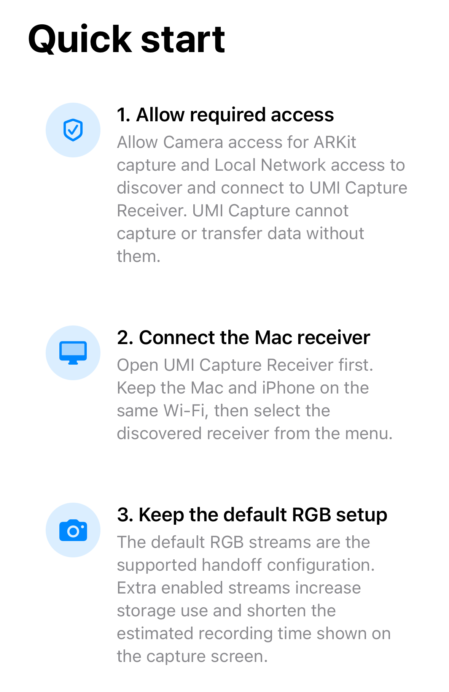
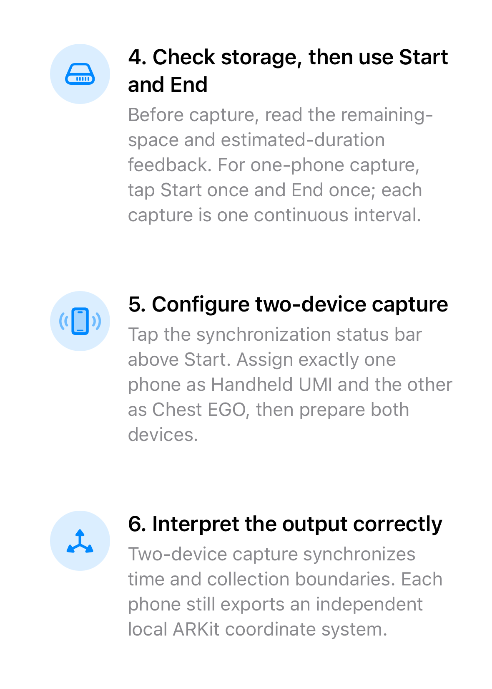
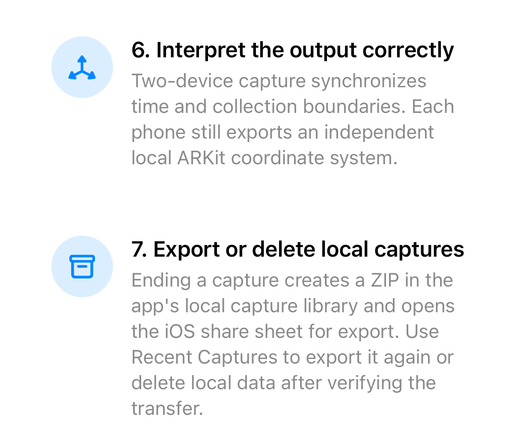

# UMI Capture

**Experimental research software — v0.1.0-experimental. Source release only.**
Physical-device end-to-end acceptance is still in progress. Simulator builds
and source tests do not establish real-camera, synchronization, or robot readiness.

UMI Capture is an independently implemented ARKit capture client and Python
Receiver for two-iPhone robot-learning experiments.
Do not expose the Receiver directly to the Internet or an untrusted network.
Hand and Ego share time but retain independent ARKit spatial frames; no
cross-device transform is inferred. No endorsement is implied by Apple or any
project named in the acknowledgements.

The complete seven-step in-app tutorial is shown below:







## Supported scope

- Build the iOS SwiftUI/ARKit source for the iOS Simulator.
- Run the protocol-v1 Python Receiver from source, with a browser dashboard,
  session coordination, pose reception, and authorized capture uploads.
- Inspect the capture-package contract and the
  [public physical-TCP coordinate contract](docs/public/coordinate-frames.md),
  and run synthetic tests.
- Follow the standalone [quick start](docs/public/quick-start.md).

## Unsupported scope

This release excludes the private Mac GUI, processing workers, bundled runtime,
documentation website, prebuilt applications, and real capture data. It provides
no IPA, DMG, native Windows/Ubuntu package, notarized application, or completed
real-device acceptance. Native packages are distinct from the source Python
Receiver. See [known limitations](docs/public/known-limitations.md).

## Requirements

For the iOS build: macOS, Xcode with an iOS Simulator SDK supporting the iOS 17.2
deployment target, and CocoaPods. Receiver execution is supported on macOS with
Python 3.12, pip, and venv. The implementation retains portable paths, but Ubuntu
execution is not a supported or verified first-release path. Dependency
installation requires network access. Simulator builds need no Apple signing
team; installation on physical iPhones requires your own signing configuration
and is outside the accepted build path.

Run all commands below from the repository root.

## Source verification (before CocoaPods)

Run the complete source verification from a pristine checkout before `pod install`
or any other dependency generator can modify tracked files. If CocoaPods has
already run in a checkout, perform verification in a separate clean checkout;
do not update `PUBLIC_SOURCE_MANIFEST.json` to accommodate generated changes.
Prepare the Receiver environment, then run the canonical gate:

```bash
python3 -m venv .venv
.venv/bin/python -m pip install -r apps/macos/requirements-receiver.txt
PYTHON="$PWD/.venv/bin/python" tools/verify_public_source.sh
```

The gate covers public boundaries, contracts, dependencies, Receiver tests, and
an actual Receiver subprocess smoke test on a temporary loopback port. The
public CI scope is the source Python Receiver on macOS plus an iOS Simulator
build; this is not evidence of physical-device acceptance, Ubuntu Receiver
support, or native application packaging.

## iOS Simulator build

```bash
pod install --project-directory=apps/ios
xcodebuild build \
  -workspace apps/ios/UMICapture.xcworkspace \
  -scheme UMICapture \
  -configuration Debug \
  -destination 'generic/platform=iOS Simulator' \
  -derivedDataPath /private/tmp/umi-capture-ios \
  CODE_SIGNING_ALLOWED=NO
```

The Simulator can demonstrate the interface. It cannot validate the physical
camera or ARKit capture workflow shown in the onboarding screenshots.

## Python Receiver launch

```bash
python3 -m venv .venv
.venv/bin/python -m pip install -r apps/macos/requirements-receiver.txt
mkdir -p "$PWD/umi-library/recordings" "$PWD/umi-library/uploads"
.venv/bin/python apps/macos/Resources/Receiver/receiver.py \
  --host 127.0.0.1 \
  --port 5566 \
  --recordings-dir "$PWD/umi-library/recordings" \
  --capture-upload-root "$PWD/umi-library/uploads"
```

Open the [dashboard](http://127.0.0.1:5566) or
[health endpoint](http://127.0.0.1:5566/health). The default is loopback only.
The Simulator Receiver settings use host `127.0.0.1`; set port `5566` to match
this command. For phones on a trusted isolated LAN, follow the explicit
[LAN launch instructions](apps/macos/README.md#trusted-lan-access).

## Two-phone workflow

The intended physical workflow, still awaiting end-to-end acceptance, uses one
Hand phone (`wrist_umi`) and one Ego phone (`ego`) on the same trusted LAN as the
Receiver. Enter the Receiver computer's LAN address and port on both phones;
`127.0.0.1` on a physical phone refers to that phone itself. Prepare the pair,
keep both apps foregrounded, start and stop a short capture, then wait for both
finalized acknowledgements and Receiver upload authorization. Confirm both ZIP
uploads commit with matching size and SHA-256. The
[quick start](docs/public/quick-start.md) explains the readiness and upload steps.

## Outputs and coordinate boundary

**Shared session time; independent ARKit spatial frames.** Hand and Ego are
coordinated in time; no cross-device spatial transform is inferred. Capture
ZIPs contain versioned metadata, declared artifacts, integrity checks, and
software provenance. Runtime ARKit intrinsics and the project-owned physical
TCP profile remain in the iOS source; approximate camera profiles are not
laboratory calibration. The public Receiver does not produce processed
robot-ready training datasets. See [coordinate frames](docs/public/coordinate-frames.md),
the [package contract](contracts/capture-package.md), and
the [protocol contract](contracts/protocol-v1.md).

## Roadmap

Remaining work includes physical-device acceptance, Ubuntu Receiver testing,
reproducible benchmarks, maintained translated documentation, and separately
evaluated binary packaging and processing distribution. These are unavailable
in this release and have no promised delivery date.

## License

Project-owned source is [MIT licensed](LICENSE). Dependency terms and source
distribution boundaries are documented under [third_party](third_party/README.md).

## Acknowledgements

UMI Capture uses Apple ARKit and is inspired by Universal Manipulation Interface,
UMI on Legs, iPhUMI, and iPhoneVIO. No endorsement is implied. Historical
protocol-v1 identifiers remain only for wire compatibility. See [NOTICE](NOTICE).
