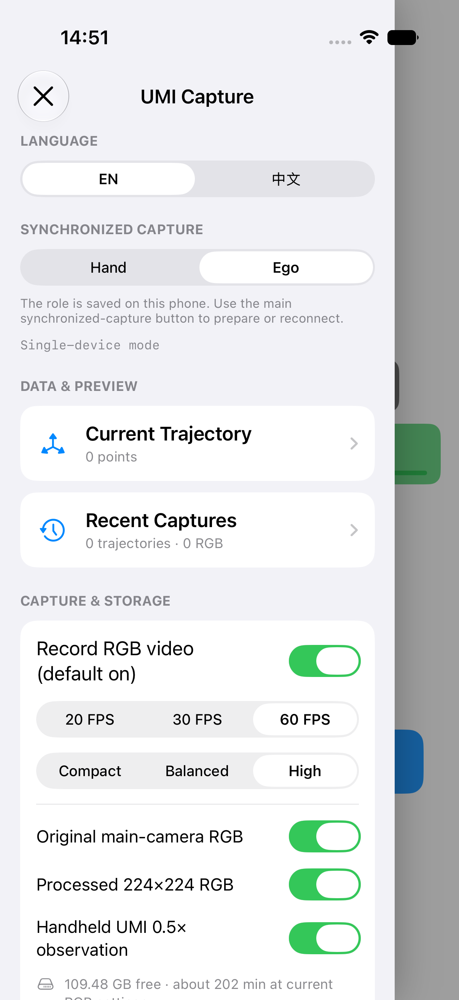
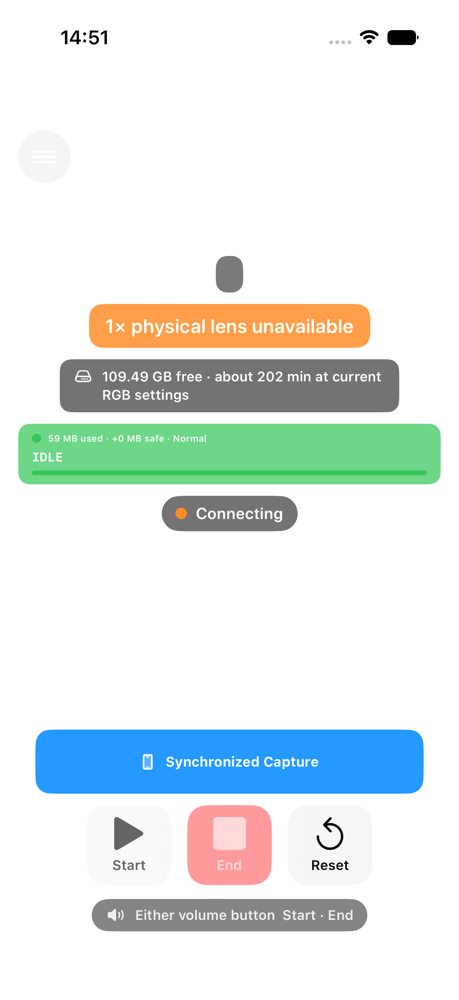

# Quick start

UMI Capture v0.1.0-experimental is experimental research software distributed as
source only. Follow the [repository build and Receiver commands](../../README.md)
first. These existing English Simulator screenshots illustrate the interface;
they are not physical-device acceptance evidence. Labels mentioning a Mac
Receiver refer to the connection workflow; the public distribution supplies
only the source Python Receiver and its browser dashboard.

## 1. Open the interface

Build the iOS Simulator app with the README command, then open
`apps/ios/UMICapture.xcworkspace` in Xcode and run the `UMICapture` scheme on an
iPhone Simulator. Read the first-run guidance. Camera capture and ARKit tracking
require physical iPhones and remain outside Simulator validation.

The in-app tutorial contains seven steps. These three Simulator captures show
the complete sequence using the app's rendered interface and text:

## 2. Assign roles

For the intended two-phone experiment, assign exactly one phone Hand
(`wrist_umi`) and the other Ego (`ego`). Hand represents the capture assembly's
physical tool-center point (TCP); Ego supplies an independent scene view. Use
the intended physical mount and its validated profile for Hand. Installation
and end-to-end acceptance on real hardware remain in progress.

## 3. Connect the Receiver

Start the Python Receiver using the README command and open its browser
dashboard. In the Simulator, enter host `127.0.0.1` and port `5566`. Enter any
pairing token required by your Receiver configuration.

For physical phones, use the [trusted-LAN Receiver command](../../apps/macos/README.md#trusted-lan-access)
with `--host 0.0.0.0 --allow-lan`. Put both phones and the computer on the same
trusted isolated LAN, allow the app's local-network permission, and enter the
computer's actual LAN address and port `5566`. A phone's `127.0.0.1` cannot reach
the computer. Do not expose this service to the Internet or an untrusted network.

## 4. Prepare, capture, and upload

The following is the intended physical workflow, not a completed acceptance test:

1. Connect both roles to the same Receiver and prepare synchronized capture.
   Hand readiness requires normal tracking and a fresh current-generation 0.5×
   observation. An unsupported camera configuration or failed readiness check
   blocks capture; do not bypass it.
2. Keep both apps foregrounded. Start and stop one short synchronized capture.
3. Wait for both finalized acknowledgements and Receiver upload authorization
   for the same session and generation. Each phone retains its finalized ZIP
   until the authorized upload workflow can proceed.
4. Confirm both ZIP uploads commit with their declared byte count and SHA-256.
   A successful dashboard or `/health` response alone does not establish upload
   integrity or physical capture acceptance.

The public workflow ends with source Receiver reception and committed packages.
Private Mac processing, preview/export tooling, and robot-ready dataset
generation are unavailable. Read [known limitations](known-limitations.md) and
[coordinate frames](coordinate-frames.md) before interpreting a recording.
